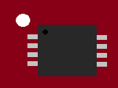
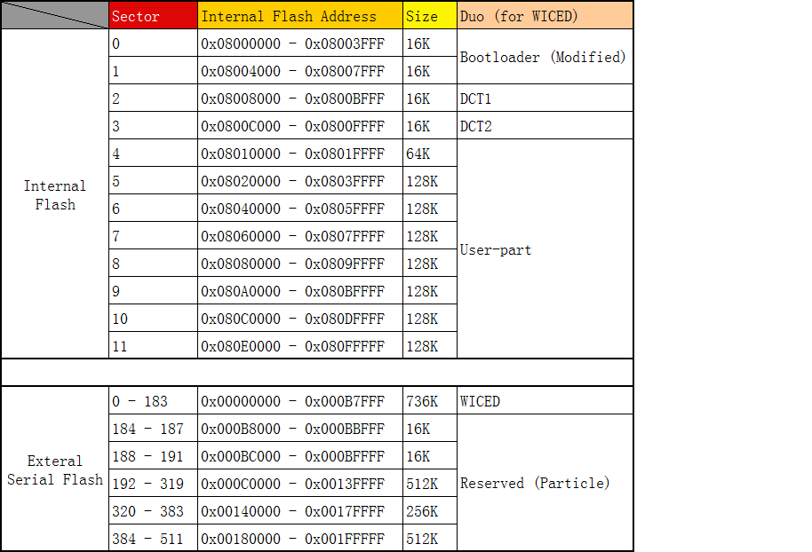

## WICED SDK Add-on for RedBear Duo

**!!!IMPORTTANT NOTE!!!: Since the WICED-SDK-4.1, after applying the patch, the memory map of Duo has been changed. See the following memory map. If you are going to deploy WICED applications and WICED DCT via the Particle bootloader, only if the Particle bootloader version is updated to 5 or above (by updating the Particle system firmware v0.3.0 or above, or by RBLink if you have), then you can apply the patch of the WICED-SDK-4.1 or above, otherwise, if it is running the older bootloader, it will not jump to run the WICED application. If the Particle bootloader version is below 5, please checkout other branch and apply the patch of the corresponding WICED SDK.**

The [RedBear Duo](http://redbear.cc/duo/) supports Cypress WICED WiFi SDK by adding this add-on. The Duo IoT development kit has two boards, the Duo and the RBLink.

It is highly recommended you to use the RBLink for development with the Duo and WICED SDK since it is very good for debugging. However, it is also possible if you do not have the RBLink but also want to try the WICED SDK, you can use the bootloader DFU mode in this case.

Moreover, with the RBLink, if you have MFi license and the CoProcessor (authenticatiuon chip), you can solder it to the RBLink, then you can try MFi projects (e.g. HomeKit). In this case, you need to manually uncomment the following code in "WICED-Studio-4.1/43xxx_Wi-Fi/platforms/RB_DUO/platform.c" or "WICED-Studio-4.1/43xxx_Wi-Fi/platforms/RB_DUO_ext/platform.c":

	#if 0
	/* MFI-related variables */
	const wiced_i2c_device_t auth_chip_i2c_device =
	{
	    .port          = WICED_I2C_1,
	    .address       = 0x11,
	    .address_width = I2C_ADDRESS_WIDTH_7BIT,
	    .speed_mode    = I2C_STANDARD_SPEED_MODE,
	};
	const platform_mfi_auth_chip_t platform_auth_chip =
	{
	    .i2c_device = &auth_chip_i2c_device,
	    .reset_pin  = WICED_GPIO_NONE
	};
	#endif

**Note: The RBLink will only work with OSX version 10.11.4 or above.**

The Duo contains a ST32F205 MCU runs at 120 MHz, AP6212A WiFi (802.11 b/g/n 2.4GHz) + Bluetooth (4.1) combo module and an onboard 2 MB SPI Flash. The MCU has 1 MB Flash and 128 KB SRAM. The wireless module built around Broadcom BCM43438 A1 chip.

## Pinout

### Duo

### RBLink

The RBLink is a MCU flash programmer/debugger for the Duo to download firmware (also works for other ST MCUs) based on STLink, it also supports USB CDC for debugging using serial print out.

* For Windows, go to ST official website to download and install the [STLink driver](http://www.st.com/web/en/catalog/tools/PF260219):

	* http://www.st.com/web/en/catalog/tools/PF260219

* For OSX and Linux, no driver is required.

* If you need to solder the CoProcessor (CoP) for MFi projects, the CoP has a **BLACK** dot at the corner and a **WHITE** dot at the RBLink CoP area, this indicates the direction for soldering the CoP to the RBLink board. See the following diagram. The jumper J8 is set to high for the I2C address.

## Download WICED SDK

To use the Duo with WICED-Studio-5.0.1:

* Download Cypress WICED SDK:

    * [WICED Studio 5.0.1 IDE Installer](https://community.cypress.com/community/wiced-wifi/wiced-wifi-documentation)

* Install it to your local file-system

* Download and copy the `WICED-Studio-5.0` folder in this patch to where the WICED-Studio-5.0.1 is installed, replace the original files.

For MFi developer, you need to apply from Cypress for another SDK.

## Memory Map

## Firmware

You can use either Windows, OSX or Linux to compile your firmware and use the bootloader DFU mode or the RBLink to upload your firmware for the Duo.

* See [Firmware Compilation Guide](docs/FW_Make.md) for details.

## Bluetooth Stack

The SDK comes with a closed source Bluetooth Stack, which has some limitations. If you want an open source stack, you can try [BTstack](https://github.com/bluekitchen/btstack/tree/master/port/wiced). For the older WICED 3.3.1 you need to use the `ble-api-cleanup` [branch](https://github.com/bluekitchen/btstack/tree/ble-api-cleanup/port/wiced).

## Limitations

* Debugging

	The SDK makes use USB to Serial port for debug messages, so you need to use the RBLink's USB to print out debug messages or any other USB to Serial (3.3V) dongle connecting the Duo uart pins. The Duo's USB will not work, unless we implement a CDC driver on it (To be done, if you can contribute, please contact us).

## Other Tools

* The RBLink is compatible with the [STLink Utility](http://www.st.com/web/en/catalog/tools/PF258168)
* ST Visual Programmer (STVP)
* qstlink
* pystlimk

## Resources

* [Cypress WICED WiFi](https://community.cypress.com/community/wiced-wifi)
* [BTstack for WICED](https://github.com/bluekitchen/btstack/tree/master/port/wiced)
